# SOTA Action-only PR Review Roadmap

## Summary and current behavior

PRBot currently is a diff-only, single-model reviewer:

- [review.rs](/Users/jaibhasin/conductor/workspaces/prbot/pyongyang/src/review.rs:11) fetches the first 100 changed files, selects at most 25 files and 80,000 patch characters, then sends those patches to one hardcoded DeepSeek model.
- The model receives no repository checkout, related files, symbols, PR description, issue context, checks, tests, or repository instructions.
- Findings are validated only for path, severity, nonempty text, and whether the numeric line is an added line.
- Each finding becomes a separate API call and each run creates another summary comment.
- The `issue_comment` flow sees timeline comments but explicitly has no code or diff tools. Every human comment can currently trigger it.
- [github.rs](/Users/jaibhasin/conductor/workspaces/prbot/pyongyang/src/github.rs:39) has no pagination, retry policy, rate-limit handling, or batched review publishing.
- `--dry-run` exits before gathering context, so the existing self-test does not exercise the review pipeline.

The target is a read-only, precision-first reviewer with automatic related-file discovery, complete and disclosed diff coverage, bounded agentic exploration, independent verification, and measurable quality gates.

## Target architecture and behavior

```mermaid
flowchart LR
    A[GitHub event or /prbot command] --> B[Owner authorization]
    B --> C[Exact PR base and head snapshot]
    C --> D[Diff manifest and structural context graph]
    D --> E[Semantic review bundles]
    E --> F[Parallel read-only reviewers]
    F --> G[Cross-bundle audit]
    G --> H[Independent verifier]
    H --> I[Anchor validation and deduplication]
    I --> J[One formal review and updated summary]
```



### Authorization and triggers

- Authorize before checking for an OpenRouter secret or making any LLM call.
- Treat GitHub repository permission `admin` as “repository owner.”
- Automatically review PRs whose author has `admin` permission, including later synchronizations.
- Other PRs receive no automatic LLM run. An owner can start or refresh them with `/prbot review`.
- Only owners can use `/prbot review`, `/prbot ask <question>`, or `/prbot explain <finding>`.
- Ignore ordinary comments. Give explicit but deterministic, zero-token denial responses to unauthorized `/prbot` commands.
- Replies appear as `github-actions[bot]`. Do not represent `/prbot` as a real GitHub mention.
- Support fork PRs through an owner’s `issue_comment` command. Do not use `pull_request_target`.

### Repository and context engine

- Fetch PR metadata, exact base/head SHAs, existing check results, and capped same-repository linked-issue context.
- Create an ephemeral Git object store and fetch the base plus `refs/pull/<number>/head`. Verify the fetched head matches GitHub’s reported SHA.
- Never execute or directly check out project code. Read files through Git object commands so symlinks cannot escape the repository.
- Compute the authoritative local diff with rename, deletion, context-line, binary, and multiline support. GitHub patch fragments are not the source of truth.
- Load `.prbot.toml` and hierarchical `AGENTS.md` instructions from the trusted base revision only. PR title, body, comments, and head files remain untrusted data.
- Build syntax-aware definitions, imports, and references for Rust, TypeScript, JavaScript, Python, and Go using tree-sitter.
- Rank related files using changed symbols, import edges, identifier references, directory proximity, matching tests, manifests, and a two-hop dependency expansion.
- Use bounded import heuristics and code search for all other currently supported file types.
- Keep indexing ephemeral. Do not add embeddings, a vector database, or a hosted service.

### Review pipeline

- Produce a deterministic manifest assigning every eligible changed hunk to exactly one semantic bundle. Related implementation, tests, schemas, configuration, and callers may share a bundle.
- Generated, vendored, binary, or explicitly excluded changes remain visible in coverage reporting rather than being silently skipped.
- Run up to eight bundles concurrently.
- Every bundle gets a correctness reviewer. High-risk signals add security, compatibility, API, concurrency, or performance specialists.
- Give agents only typed, read-only tools:
  - `list_tree`
  - `read_file` with base/head revision and a 400-line limit
  - `read_diff`
  - `search_code` with result and time limits
  - `find_symbol`
  - `find_references`
  - `get_pr_context`
- Tool outputs are paginated and capped at approximately 10,000 characters. Agents receive no shell, write, environment, arbitrary Git, or network tool.
- Run a cross-bundle audit for missed interface changes, duplicated logic, inconsistent callers, and test-impact gaps.
- Send all candidate findings to a verifier from a different model family. The verifier must reproduce the execution path and cite changed-code plus related-file evidence.
- Suppress speculative, pre-existing, style-only, and missing-test-only findings unless they demonstrate a concrete risk.
- Use `P0` through `P3` internally. Publish only independently verified `P0` through `P2` findings. Keep `P3` observations in the summary or suppress them.

### Anchoring and publishing

- Model findings identify exact anchor text, side, category, evidence spans, and affected symbol. Models do not choose the final GitHub line number.
- Resolve anchors deterministically against the current diff and support right-side additions, left-side deletions, multiline ranges, context lines, renames, and file-level fallback.
- Recheck the PR head immediately before publishing. If it changed, discard the result and retry once against the new head.
- Publish at most 12 highest-priority findings in one formal GitHub review with event `COMMENT`.
- Maintain one versioned summary comment containing coverage, reviewed SHA, models, token/cost usage, elapsed time, partial failures, and stable finding fingerprints.
- On reruns, review bundles affected since the stored head while retaining full-PR context. Revalidate existing findings and never repost an unchanged fingerprint.
- Never report “looks fine” when coverage is partial. Use “No verified findings” only after complete eligible coverage.

## Interfaces and staged implementation

### Public configuration

Preserve existing inputs and add:

- `review_model` and `verification_model`: optional OpenRouter model IDs. Blank selects the release-pinned evaluated pair.
- `max_review_minutes`: default `15`.
- `max_input_tokens`: default `500000` across all model calls.
- `max_cost_usd`: default estimated ceiling `3.00`.
- `max_concurrency`: default `8`.
- `max_comments`: default `12`.
- `engine`: `contextual` or `legacy`, used as a temporary rollback control.

Action inputs are hard ceilings. Trusted repository configuration may reduce but never increase time, token, cost, concurrency, or comment limits.

Add a base-revision `.prbot.toml` schema:

```toml
[review]
auto_review = "owner-authored"
include = ["**/*"]
exclude = ["**/vendor/**", "**/generated/**", "**/*.lock"]
instructions = []
max_comments = 12

[[path_rules]]
glob = "src/auth/**"
instructions = ["Prioritize authorization boundary regressions."]
```

Precedence is: action inputs and hard security rules, trusted `.prbot.toml`, hierarchical trusted `AGENTS.md`, built-in defaults.

Expand `--dry-run` to fetch the PR, build the manifest and bundles, and emit machine-readable JSON without invoking models or writing to GitHub.

### Internal contracts

Introduce explicit types for:

- `ReviewRun`: trigger, actor authorization, repository identity, base/head SHAs, and budget ledger.
- `ReviewManifest`: all changed files and hunks, exclusions, bundles, risk scores, and coverage status.
- `CandidateFinding`: semantic anchor, category, priority, explanation, confidence, and evidence spans.
- `ResolvedFinding`: validated GitHub side/line range plus stable fingerprint.
- `RunOutcome`: complete, partial, skipped, or failed, with budget and failure details.

Split the current 723-line orchestration into focused GitHub, repository-context, LLM/tool-loop, agent, and reporting subsystems. Keep `main.rs` limited to parsing and dispatch.

### Delivery milestones

1. Establish the evaluation fixtures and refactor the monolith without changing behavior.
2. Add owner authorization, pagination, retries, timeouts, PR metadata, check ingestion, and exact ephemeral Git snapshots.
3. Add local diff parsing, trusted instructions, structural related-file ranking, semantic bundles, and bounded tools.
4. Add parallel specialist reviewers, cross-bundle auditing, independent verification, and the global budget ledger.
5. Add robust anchor resolution, batched reviews, summary updates, fingerprints, incremental reruns, and `/prbot` commands.
6. Dogfood `contextual` behind the engine switch. Flip it to the default only after the evaluation gate, retain `legacy` for one release, then remove it.

Each milestone should land as several small commits with tests passing after every meaningful unit.

## Test and evaluation plan

### Automated coverage

- Unit-test pagination, diff parsing, renames/deletions, bundle coverage, graph ranking, fallback search, budget allocation, command parsing, fingerprints, and all anchor forms.
- Test tool path validation, revision restrictions, output truncation, timeouts, malformed tool calls, and symlink/path traversal attempts.
- Integration-test against mock GitHub and OpenRouter servers, including rate limits, transient failures, invalid structured output, partial bundle failures, stale heads, and duplicate workflow delivery.
- Add container-level E2E fixtures that create real local Git repositories and PR-shaped refs, then run the Action through automatic owner review and owner-command review paths.
- Verify non-owner events and commands produce zero LLM requests.
- Add prompt-injection fixtures in source, PR descriptions, and comments that attempt to reveal secrets, execute commands, alter instructions, or access the network.
- Keep `cargo test`, formatting, and clippy warning-free throughout.

### Model and quality gate

- Build at least 50 held-out fixtures across the five syntax-aware languages, including real historical defects, controlled mutations, clean PRs, cross-file bugs, and security-sensitive changes.
- Label findings with two human reviewers and adjudicate disagreements.
- Evaluate current tool-capable GPT, Claude, and DeepSeek families through OpenRouter. The verifier must use a different provider family from the primary reviewer.
- Pin the pair that maximizes published-finding precision while satisfying:
  - At least 90 percent actionable precision.
  - At least 75 percent recall for adjudicated P0/P1 defects.
  - 100 percent valid GitHub anchors.
  - At least 99 percent eligible-hunk coverage accounting.
  - Less than 1 percent duplicate published findings.
  - Zero model calls for unauthorized actors.
  - No false clean result after a partial run.
  - Median small-PR review under 5 minutes and every run respecting the 15-minute, 500,000-input-token, and estimated $3 ceilings.
- If no model pair passes, keep the contextual engine opt-in and improve the pipeline before changing the default.
- Where product access permits, run the same held-out PRs through CodeRabbit, Codex review, and Cursor review for a blind usefulness comparison. Independent precision and recall gates remain authoritative.

## Assumptions and design sources

- This remains an ephemeral GitHub Action with no GitHub App, hosted control plane, persistent index, dashboard, or learning database.
- PRBot reviews and explains code but never runs project scripts, tests, builds, package managers, or generated fixes.
- External contributors cannot spend tokens directly. Their PRs require an owner’s `/prbot review`.
- A budget or subsystem failure produces an explicit partial result and preserves successful bundles.
- The implementation will borrow architectural patterns, not source code: adaptive context and reflection from [PR-Agent](https://docs.pr-agent.ai/core-abilities/dynamic_context/), ranked structural maps from [Aider](https://aider.chat/docs/repomap.html), bounded tools from [OpenCode](https://opencode.ai/docs/tools) and [Serge](https://huggingface.github.io/serge/), deterministic bundling and filtering from [Alibaba OpenCodeReview](https://github.com/alibaba/open-code-review), local repository access from the [Codex GitHub Action](https://github.com/openai/codex-action), and blast-radius context from [Mira](https://docs.miracode.ai/).
- Closed reviewer internals will not be guessed or copied. Their observable output quality will be compared through the held-out evaluation suite.
